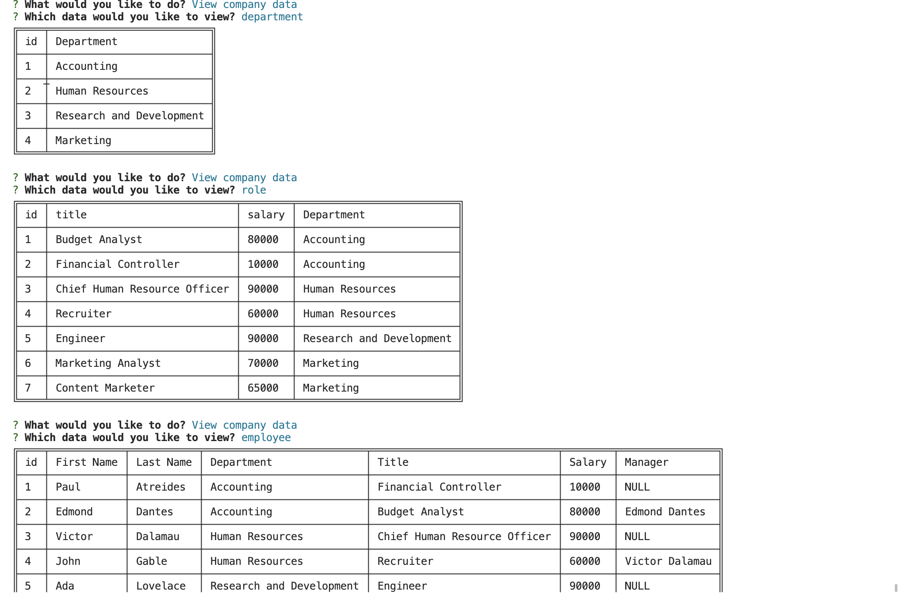

# Employee Content Management Application

## Table of Contents
-[Description](#description)
 
-[Installation](#installation)
 
-[Usage](#usage)
 
-[Contributing](#contributing)
 
-[License](#license)
 
-[Tests](#tests)
 
-[Questions](#questions)
 

## Description

This project is a content management application to perform various operations pertaining to an organization employees and department.  Using CLI prompts, the user has a variety of options to either read, add, or update data.  The data will be held in a database and the user will have only have access to the companies information.  For this assignment the main objective was to give the user access to data using PostgreSQL to perform one of the three CRUD operations.  Depending on which CRUD operation needed to be utilized, specific SQL statements would perform a specific action on the database.  This application helps companies and individuals employees to have easy access to company information by answering a few simple prompts, as opposed to the user having to know how to navigate the database system.  There were many problems trying to connect and disconnect to the database an operation was over.  The solution I found was to create a functions that would create a new connection each time there need to be a trip to the database.  SQL statements were difficult to navigate when it came to using joins for different tables that inherited from another. 

## Installation

If you would like to install this project you can clone this repo or download copies of the all the files.  In order to use this you must have Node installed on your computer since it does utilize npm packages.  To download all the packages just type the command “npm i” since the repo already has a package.json file that holds all the dependencies.

## Usage

In order to invoke this application type the command “node app.js”.  Immediately after that command is ran a series of prompts will be displayed in the terminal that will give you a variety of options of what operations the user would like to perform.  This application is useful for organizations that need an easy way to access and manipulate company data without having to go directly know how to use PostgresSQL.

### Demo Video
[Video Link](https://drive.google.com/file/d/17czMDC6Y8p-XlYsjVGgyMJtvbwSAWAG0/view)

### Screenshot

## Contributing

N/A
## License

This repository is covered under the MIT license

## Tests

N/A

## Questions

* GitHub Profile: [EzekielCampos](https://github.com/EzekielCampos)

If you have any additional questions contact me by email at ezcampos603@gmail.com

